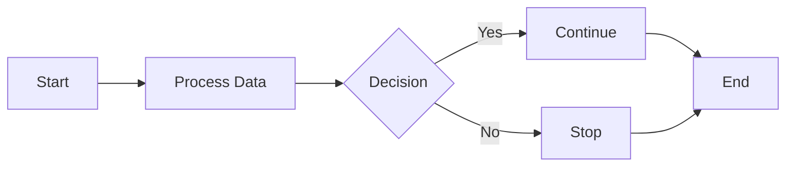
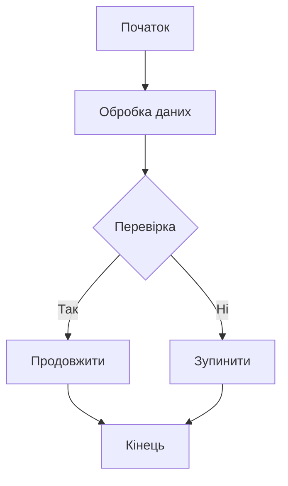
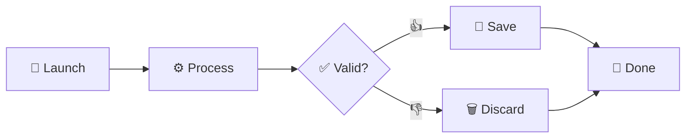
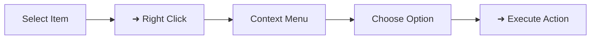

# Mermaid Diagrams

This page contains several Mermaid diagrams demonstrating different character sets.

## English Diagram

## Ukrainian Diagram

## Emoji Diagram

## Special Unicode Character Diagram (Right Click ➜)

